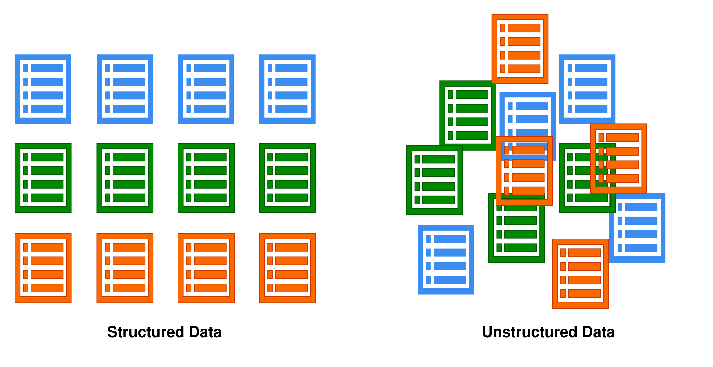
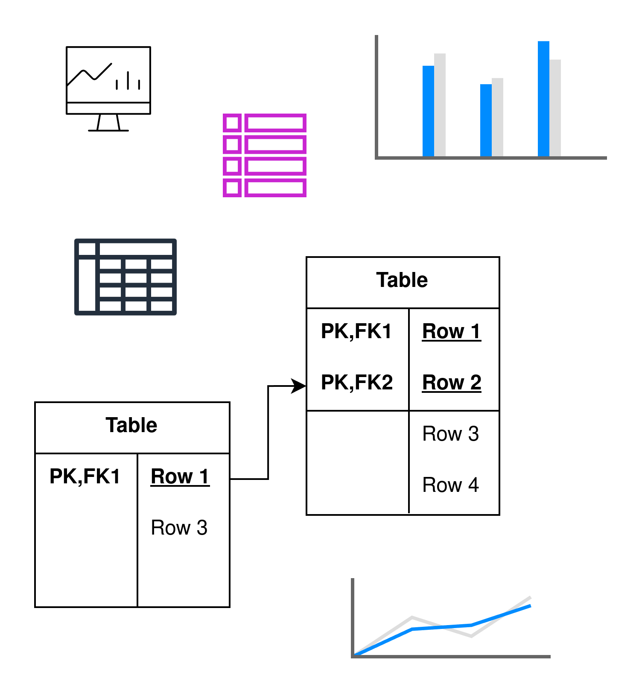

# Basic Concepts

In the vast world of data science, a variety of terms and concepts are frequently used, each serving a distinct purpose and providing unique value. For someone just beginning to explore this field, the sheer volume of jargon can be overwhelming. However, understanding a few fundamental concepts can help clarify much of the confusion. Let’s start by introducing three key pillars of data science: Data Analysis, Machine Learning, and Big Data.

## Data Analysis
At its core, data analysis is the process of inspecting, cleaning, and transforming raw data into valuable insights. This is often the first step in any data science project. Think of it as the detective work—finding patterns, relationships, and trends hidden within large sets of information. This can involve simple descriptive statistics, such as averages and percentages, as well as more complex tasks like exploratory data analysis, where patterns are discovered visually through charts and graphs. Data analysis forms the foundation for decision-making, enabling businesses and researchers to make informed choices based on actual evidence rather than intuition alone {cite:p}`mckinney2017python`.

## Machine Learning
Machine learning takes data analysis a step further. It refers to algorithms that are designed to learn from data, identify patterns, and make predictions or decisions without human intervention. Machine learning is everywhere, from the recommendations we get on Netflix to the algorithms that predict stock market trends. Common applications of machine learning include classification (sorting data into categories), regression (predicting a continuous value), clustering (grouping similar data points), and recommendation systems (suggesting products or content based on previous behavior). Key techniques like neural networks, decision trees, and support vector machines (SVM) are used to train machines to perform specific tasks with impressive accuracy {cite:p}`bishop2016pattern`.

## Big Data
Big Data is a term that describes datasets so large or complex that traditional data-processing software is inadequate to handle them. These datasets often come from diverse sources and grow rapidly in volume, variety, and velocity. Imagine trying to analyze social media posts, customer transactions, or sensor data from millions of devices—this is where Big Data comes in. The challenges of Big Data include storing vast amounts of information, processing it efficiently, and analyzing it in real-time. Technologies like Hadoop, Spark, and NoSQL databases (such as MongoDB and Cassandra) have been developed to address these challenges and make it possible to glean insights from massive datasets {cite:p}`chambers2018spark`.

In data science, these three concepts—Data Analysis, Machine Learning, and Big Data—are foundational. They help data scientists turn raw data into meaningful information, develop systems that can automate decision-making, and handle datasets that were previously unmanageable. Understanding them is the first step toward mastering the broader, more complex landscape of data science.

## Types of Data
In data science, it is essential to understand the different types of data, as they require different approaches for processing and analysis. These types are categorized as structured, semi-structured, and unstructured data. Each of these types of data presents unique challenges and opportunities for data scientists, and choosing the right tools and techniques for processing them is crucial for successful data analysis.

### Structured Data
Structured data is highly organized and easily searchable because it is stored in a fixed format, typically in tables with rows and columns. This type of data fits neatly into databases, such as SQL, where each piece of data is clearly defined and has a specific data type (e.g., integers, text, dates). Examples of structured data include customer information (name, address, phone number), sales transactions, and employee records. Structured data is easy to analyze using traditional data tools and algorithms {cite:p}`GANDOMI2015137`.

### Semi-Structured Data
Semi-structured data doesn’t fit neatly into tables like structured data, but it still contains some elements of organization, such as tags or markers to separate different pieces of information. This data type may include a mix of structured and unstructured elements, which allows for more flexibility in storing and processing. A common example is XML or JSON files, where data is organized with tags but does not have the rigid structure of a relational database. Semi-structured data is often used in web data, social media posts, and emails {cite:p}`GANDOMI2015137`.

### Unstructured Data
Unstructured data refers to any data that doesn’t have a pre-defined format or organization. It can come in the form of text, images, videos, or even audio files. Unstructured data is the most difficult to analyze because it doesn’t fit neatly into traditional database systems. Examples of unstructured data include social media posts, customer feedback, emails, images, and videos. This type of data often requires advanced techniques such as natural language processing (NLP) and computer vision to extract meaningful information {cite:p}`GANDOMI2015137`.

## Data Science Careers
As the demand for data-driven decision-making continues to grow across industries, the field of data science has expanded into various specialized careers. Below are some of the most common roles in the data science domain, each contributing to different aspects of working with data.

### Data Scientist
A Data Scientist is a professional who analyzes and interprets complex data to provide actionable insights. They work with large datasets, perform advanced statistical analysis, build machine learning models, and use data visualization tools to communicate their findings. Data scientists often create predictive models and develop algorithms to solve business problems. They need to be proficient in programming (e.g., Python, R), statistics, and machine learning. A Data Scientist is expected to have a strong understanding of data, algorithms, and domain-specific knowledge to deliver impactful insights.

### Machine Learning Engineer
A Machine Learning Engineer focuses on designing and implementing machine learning models and systems. Unlike data scientists, who often focus on experimenting with data and developing models, machine learning engineers take these models and turn them into production-ready systems that can handle real-world data. They are skilled in programming languages such as Python, Java, or C++, and are familiar with machine learning frameworks such as TensorFlow and PyTorch. A Machine Learning Engineer needs to optimize and scale models to make them more efficient and capable of handling large-scale data.

### Data Analyst
A Data Analyst is responsible for collecting, processing, and analyzing data to help businesses make informed decisions. They work with structured data and typically focus on generating reports, dashboards, and visualizations that provide insights into business performance. While data scientists develop predictive models, data analysts tend to focus more on descriptive analysis, such as summarizing data trends, identifying key metrics, and supporting business teams with day-to-day analysis. Skills such as SQL, Excel, and data visualization tools like Tableau or Power BI are essential for this role.

### Data Engineer
A Data Engineer builds and maintains the infrastructure required to store, process, and analyze large volumes of data. They are responsible for designing and constructing data pipelines, databases, and data warehouses, ensuring that data is accessible, secure, and organized in a way that supports analysis. Data engineers work with big data technologies such as Hadoop, Spark, and Kafka and are skilled in programming languages like Python, Java, or Scala. Their role is critical in making sure that data is collected, cleaned, and prepared in a way that data scientists and analysts can effectively use it {cite:p}`reis2022fundamentals`.

Each of these careers plays a crucial role in the data science ecosystem. Data scientists and machine learning engineers focus on modeling and algorithm development, while data analysts and engineers work on data collection, cleaning, and interpretation. Understanding these roles and how they interact is key to navigating the field of data science and choosing the path that best aligns with your interests and skills.

## Role of the Data Team
**The main role of a data team is to solve problems and deliver value to the business team. By leveraging data, analytics, and technologies, they generate insights and solutions that drive strategic and operational decisions.**

