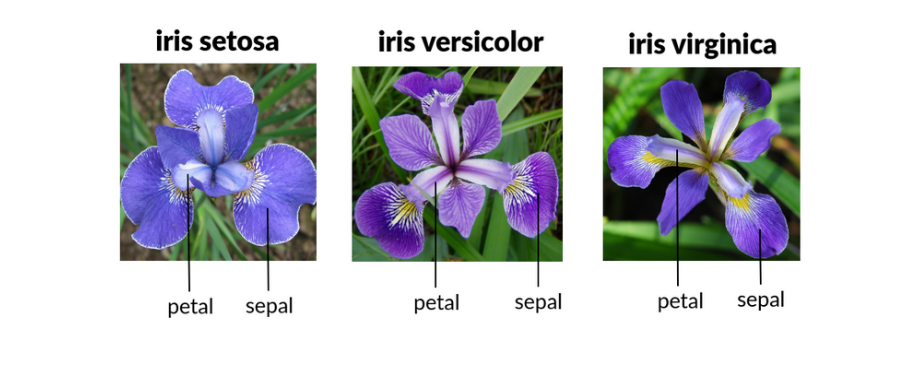

# Projects
Here are some projects (we will have much more) that we are going to explore on our journey.

## [Boston House Prices](https://www.kaggle.com/datasets/vikrishnan/boston-house-prices)

## [Iris Classification](https://www.kaggle.com/datasets/uciml/iris)

## Handwritten Digit Recognition

## [Spotify Tracks Dataset](https://www.kaggle.com/datasets/maharshipandya/-spotify-tracks-dataset)

## Customer Clustering and Segmentation

## Sentiment Analysis

## AI playing games

## Tech Skills
* Python, Pandas, NumPy, SciPy, Spark, SQL
* Sckit-learn, Seaborn, matplotlib, Optuna, SHAP
* OpenCV, PyTorch, TensorFlow
* AWS, Cloud

## Prerequisites
* Programming knowledge (python preferred)
* Calculus, Linear Algebra,
* Statistics, Probabilities
